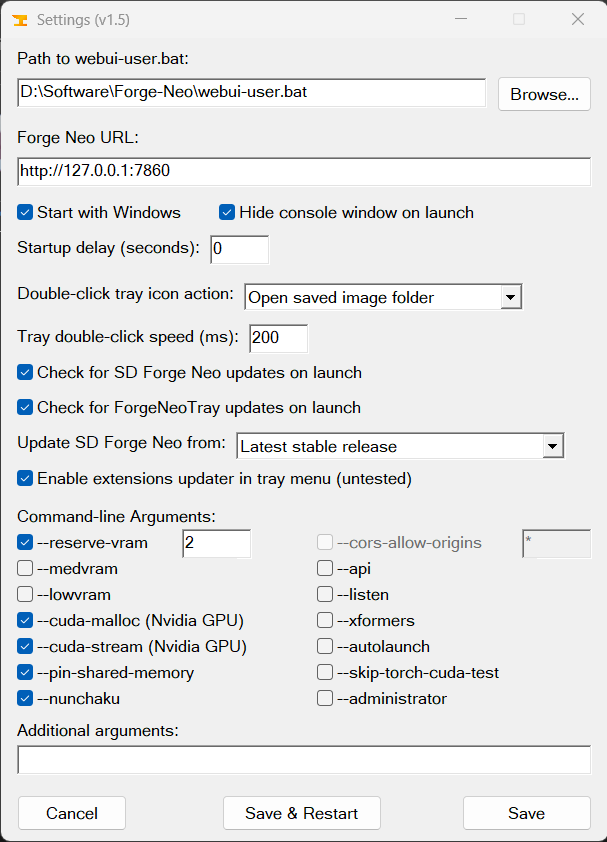

  

# ForgeNeoTray

A lightweight system tray launcher for [SD WebUI Forge Neo](https://github.com/Haoming02/sd-webui-forge-classic/tree/neo). It starts Forge Neo for you, keeps the console tucked away in the tray, and gives you a proper UI for editing `webui-user.bat`'s command-line arguments.

Portable, single `.exe`, no installer, no dependencies beyond Forge Neo itself.

*Built with AI assistance (Claude), with extensive manual testing and debugging throughout development.*

## Features

### Tray icon & launch control
- Launches Forge Neo automatically when the program starts, with the console shown or hidden per your preference
- **Single-click** the tray icon to show or hide the console window
- **Double-click** the tray icon (or use "Launch in Browser" from the menu) to open the WebUI in your browser
- **"Open..." submenu** for quick access to your Install Folder, Models folder, Saved Images folder, and your generation output folders. These read the actual configured paths from Forge Neo's own `config.json` (Settings → Saving → Paths for saving), so custom directories are picked up automatically, including switching to a single **Output** entry instead of separate txt2img/img2img ones if you've set a shared Output Directory there. Output folders also list their dated subfolders (e.g. `2026-07-28`) if any exist. A **Refresh** option rebuilds the list on demand instead of waiting for the automatic 60-second refresh
- **Restart Forge Neo** from the tray menu. It kills the whole process tree rather than just closing a window, so it still works even if Windows Terminal is your default terminal app
- Background monitoring sends a tray notification if Forge Neo's process dies unexpectedly, so a silent crash doesn't go unnoticed

### Updates
- **Check for Updates** from the tray. It only ever fast-forwards. If your local history can't be safely fast-forwarded, it tells you instead of resetting or discarding anything
- Choose your update track in Settings: **Latest stable release** (tagged versions only) or **Latest commits** (tracks the branch directly, which may include unfinished work or bugs between releases)
- Optional **silent check on launch**: a tray notification tells you if an update's available, and clicking it opens the update dialogue directly (no automatic installation)
- **Extensions updater** (optional, toggle in Settings): update one extension at a time, or use **Update All** for a checklist showing which extensions have an update, so you can pick which ones to grab (untested as my extensions have not been updated recently)
- Every update result can be expanded to show the actual `git` output
- If something was actually updated, a one-click restart button appears alongside the result

### Settings window
- Change the path to `webui-user.bat`, the WebUI URL, launch-on-Windows-startup, console visibility, and a startup delay (useful if this runs at login before your GPU driver is ready)
- A checkbox for each of 14 common `COMMANDLINE_ARGS` flags (`--reserve-vram`, `--cuda-malloc`, `--cuda-stream`, `--pin-shared-memory`, `--nunchaku`, `--cors-allow-origins`, `--api`, `--listen`, `--xformers`, `--medvram`, `--lowvram`, `--autolaunch`, `--skip-torch-cuda-test`, `--administrator`)
- `--medvram` and `--lowvram` grey each other out, since they're mutually exclusive
- `--cors-allow-origins` stays disabled until `--api` is on, since it does nothing without it
- Anything you've set that isn't one of the 14 checkboxes lands in an "Additional arguments" field automatically. Nothing you've customised gets dropped
- Switching to a different `.bat` file via Browse refreshes argument checkboxes to match it, handy if you run more than one Forge Neo install
- A backup copy of your `.bat` (`webui-user.bat.bak`) is made before every save

### First-run setup
- If `webui-user.bat` is in the same folder as the `.exe`, it's found automatically
- If not, locate it via a dialogue
- Store the `.exe` anywhere

## Requirements
- Windows 10 or 11
- [SD WebUI Forge Neo](https://github.com/Haoming02/sd-webui-forge-classic/tree/neo) already installed, with a working `webui-user.bat`
- `git` on your `PATH`, only needed for the update-checking features. If you installed Forge Neo the normal way (via `git clone`), you already have it

## Usage
1. Download `ForgeNeoTray.exe` and place it in your Forge Neo folder, next to `webui-user.bat`. If it's not there, it'll ask you to locate the file on first run.
2. Run it. Forge Neo starts automatically, and an icon appears in your tray.
3. Right-click the tray icon for Settings and other functions.

## Building from source
Compile `ForgeNeoTray.ahk` with [Ahk2Exe](https://www.autohotkey.com/) using AutoHotkey v2. No external libraries required.

To get the custom tray icon rather than the default AutoHotkey one, select `ForgeNeoTray.ico` in Ahk2Exe's Icon field when compiling.
